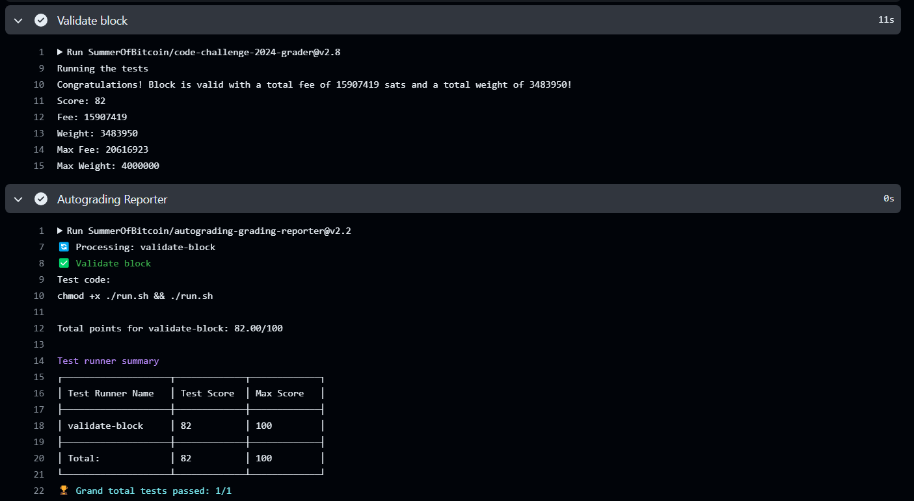

# SOLUTION.md

## Design Approach:
The block construction program takes a list of mempool transactions as input and constructs a Bitcoin block. Here's a breakdown of the key concepts involved in creating a valid block:

1. **Merkle Tree Root Calculation**: The program calculates the Merkle root of all valid transactions in the block. The Merkle root is a hash of hashes, constructed by recursively hashing pairs of transaction IDs until a single hash remains, known as the Merkle root. This ensures that any change in the transaction data will change the Merkle root, providing tamper-proofing.

2. **Coinbase Transaction**: The coinbase transaction is the first transaction in every block, serving as the mechanism by which miners are rewarded with new bitcoins. The program constructs a valid coinbase transaction with appropriate input and output scripts.

3. **Block Header Construction**: The block header contains metadata about the block, including the version, previous block hash, Merkle root, timestamp, and nonce. The program constructs a version 4 block header with the correct structure and content.

4. **Transaction Validation**: Before including transactions in the block, the program performs basic validation checks on each transaction to ensure it meets certain criteria. This includes verifying the integrity of input and output scripts, ensuring correct transaction amounts, and validating the transaction's locktime.

## Implementation Details:
Here's a high-level overview of the implementation:

1. **Transaction Serialization**: The program serializes each transaction in the correct format required for hashing and validation. It handles both regular transactions and witness transactions.

2. **Transaction Verification**: The program verifies each transaction to ensure it meets the necessary criteria for inclusion in the block. This includes checking script validity, transaction amounts, sequence number.

3. **Merkle Root Calculation**: Using a recursive algorithm and a list structure, the program calculates the Merkle root of all valid transactions in the block.

4. **Coinbase Transaction Construction**: The program constructs a valid coinbase transaction with appropriate input and output scripts, including the block height and commitment to the witness root.

5. **Block Header Construction**: Based on the calculated Merkle root and other block metadata, the program constructs a version 4 block header in the correct serialized format.

6. **Output File Generation**: Finally, the program writes the block header, coinbase transaction, and list of transaction IDs to an output file in the specified format.

## Results and Performance:
After running the program, the results are written to the `output.txt` file in the following format:

1. The first line contains the block header.
2. The second line contains the serialized coinbase transaction.
3. The following lines contain the transaction IDs (txids) of the transactions mined in the block, in order. The first txid is that of the coinbase transaction.

Below are the results logged in the terminal:
```
Valid Transactions : 3100
Invalid Transactions : 5032
```

Below are the results obtained from the autograder:


## Conclusion:
The block construction program successfully creates a Bitcoin block from a list of mempool transactions, adhering to the required standards and constraints. By accurately implementing key concepts such as Merkle tree root calculation, coinbase transaction construction, and block header creation, the program demonstrates an understanding of the Bitcoin protocol and blockchain principles.

Currently, the program doesn't consider checking for signature verification and only 3100 transactions are being mined, there is still weight left in the block to be filled. I am only including v0_p2wpkh transactions which are having 1 input only. These are some of the major fixes which are to be first implemented in future version of this mining program.

## References:
1. https://learnmeabitcoin.com/
2. https://github.com/bitcoinbook/bitcoinbook/blob/develop/BOOK.md
3. https://wiki.bitcoinsv.io/index.php/Opcodes_used_in_Bitcoin_Script